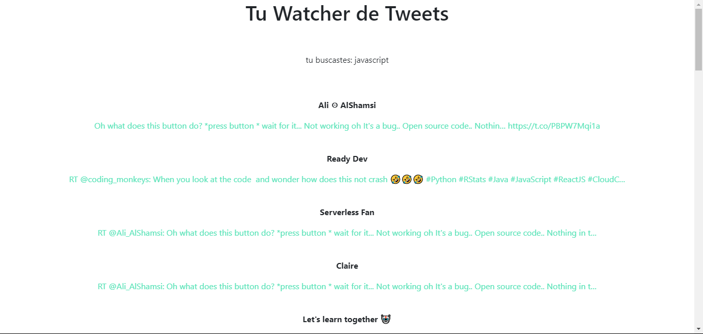
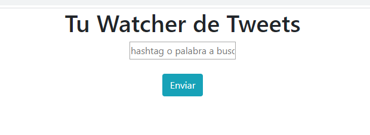

# Ticker Twitter

A Node Js Aplication for watch Twitter searching keywords and hashtags

 
 
 

##live try

https://tickertwitter.herokuapp.com/

## for install

type npm install and create a file with name "variables.env" with

### KEYCON

for your api key

### KEYCOS

for your api secret key

### TK

for your token key

### TKS

for your token secret key

## ALL OF THEN YOU CAN CREATE IN

https://developer.twitter.com/

# AFTER

you can search it in your browser just type localhost:3000

soorry english isn't is my first language

